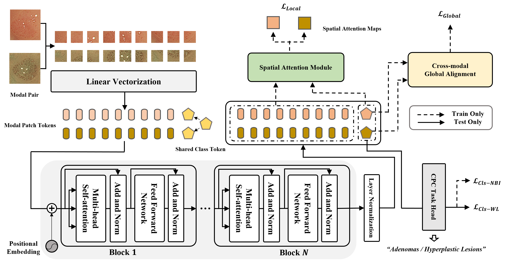
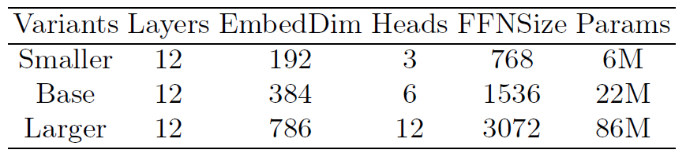

# CPC-Trans

Code for the MICCAI 2022 (early accepted) paper: "[Toward Clinically Assisted Colorectal Polyp Recognition via Structured Cross-modal Representation Consistency](https://arxiv.org/abs/)"

---
<p align="center">
  
</p>

## Dataset
We only provide the public part [[link]](https://drive.google.com/drive/folders/1e2t5HhQf08sTAE_CPRNVgpi6YUKgQSHn?usp=sharing) of the CPC-paired Dataset while the another part is privated. Thanks for understanding.

## Installation
```bash
pip install -r requirements.txt
```

## Download Pretrained Weights
We provide the pretrained weights of the model which were mentioned in the paper.
* Base Weights (vit_small_patch16_224_in21k) [link](https://drive.google.com/file/d/1I10_qXlUEtSjlvRWQjoBnKnVSLUYjF8C/view?usp=sharing)

For other model size, please refer to this table and download on the Internet or contact us to provide.
<p align="center">
  
</p>

* Smaller Weights (vit_tiny_patch16_224_in21k)
* Larger Weights (vit_base_patch16_224_in21k)


## Run
```bash
python main.py --data_path /the/data/path/ --weights /the/pretrained/weights/path/
```


## Citation
If you use any part of this code and pretrained weights for your own purpose, please cite our [paper](https://arxiv.org/abs/).
<!-- ```
@InProceedings{pmlr-v139-kim21k,
  title = 	 {Toward Clinically Assisted Colorectal Polyp Recognition via Structured Cross-modal Representation Consistency},
  author =       {Ma, Weijie and Zhu, Ye and Zhang, Ruimao},
  booktitle = 	 {Proceedings of the 25th Medical Image Computing and Computer Assisted Intervention},
  year = 	 {2022},
}
``` -->

## Contact for Issues
- [Weijie Ma](http://maweijie.site/)